# Contenido

Desafío **Manipulación de datos y transaccionalidad en las operaciones**. 

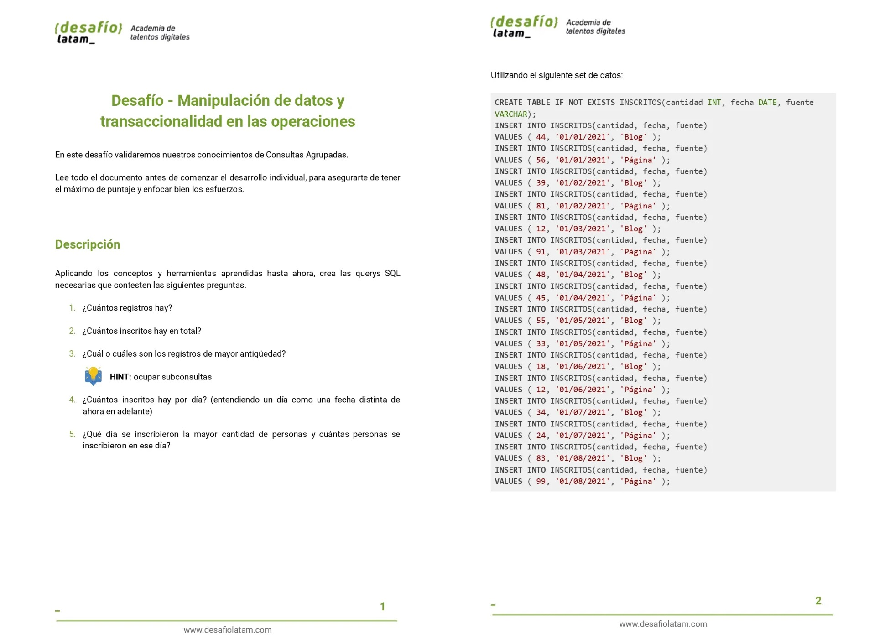
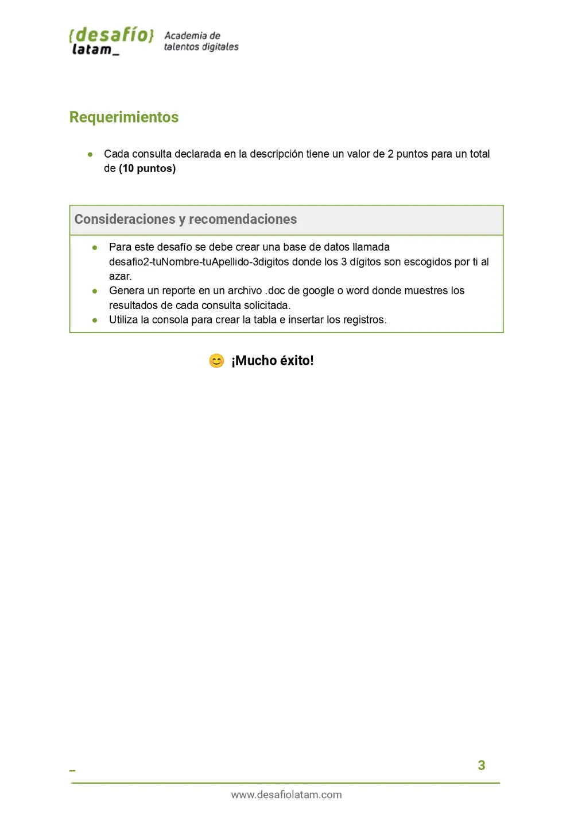

## Soluciones 

### 1. ¿Cuántos registros hay?

#### 1.1-Código

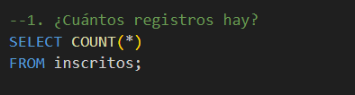

#### 1.2-respuesta

### 2. ¿Cuántos inscritos hay en total?

#### 2.1-Código

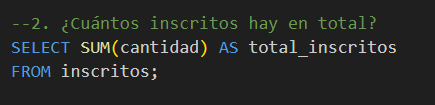

#### 2.2-respuesta

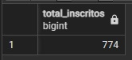

### 3. ¿Cuál o cuáles son los registros de mayor antigüedad?

#### 3.1-Código

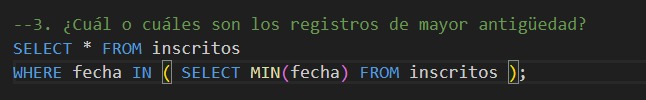

#### 3.2-respuesta

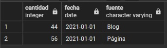

### 4. ¿Cuántos inscritos hay por día? (entendiendo un día como una fecha distinta de ahora en adelante)

#### 4.1-Código

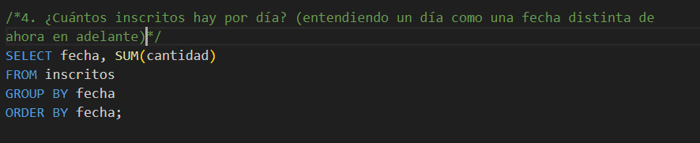

#### 4.2-respuesta

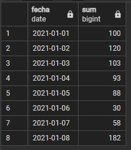

### 5. ¿Qué día se inscribieron la mayor cantidad de personas y cuántas personas se inscribieron en ese día?

#### 5.1-Código

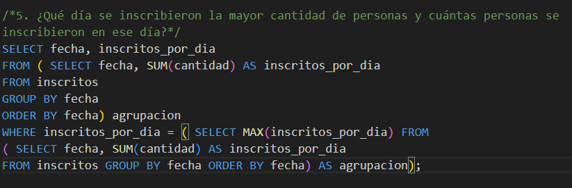

#### 5.2-respuesta

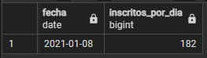

##### Forma 2

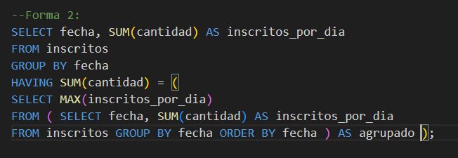

##### Forma 3

Otra manera de hacerlo si pensamos que solo hay un dia con la mayor cantidad de personas:

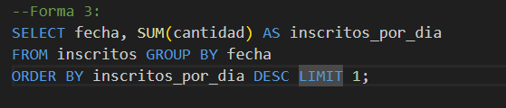
